# 关于莫娜虚实流动如何跑得更远的定性分析

原神1.1版本接近过半了，不知道大家玩得还开心吗？

鉴于官方在蒙德茶会中的爆料，在**未归的熄星**之后，我们会迎来一个名为**余肴尚温**的活动。这是一个通过送外卖获得奖励的活动。

是的，在原神里你除了挖矿，捡垃圾，做圣遗物赌狗外甚至还能送外卖。

```
刻晴：听说这个送外卖活动里不能沾染元素，不允许攀爬飞行，那么本次的MVP岂不是……
莫娜：没错，正是在下。
```

先在这里把结论奉上

I. 莫娜的虚实流动取代了冲刺，但是不属于冲刺，不会被冲刺降低消耗的**料理**或者**凯亚雷泽**固有天赋影响

II. 莫娜的虚实流动可以受到以下加成
```
两个风属性角色在队伍中 迅捷之风 体力消耗降低15% 移动速度提升10%
装备 四风原典 武器 移动速度提高10%
迪奥娜的固有天赋 猫尾的隐藏菜单 处于猫爪护盾中 体力消耗降低10% 移动速度提升10%
芭芭拉的固有天赋 光辉的季节 处于演唱，开始♪的水环中 体力消耗降低12%
```

III. 根据跑动距离得到的加成幅度对比

双风 > 迪奥娜 ≈ 芭芭拉 > 四风原典

IV. 送外卖MVP队伍

因为活动不能沾染元素，所以不能用芭芭拉。

因此带着四风原典的莫娜，加上双风系角色还有迪奥娜将成为MVP

---

下面是我为了得出结论而做的较为粗糙的定性分析

##### 前提假设

莫娜天赋说明

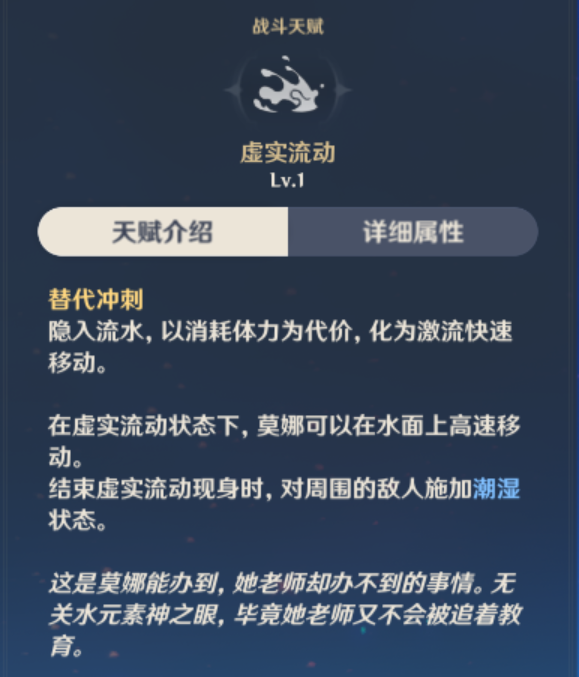

测试时体力为240，即蒙德和璃月七天神像都为10级满级

选择的跑道为璃月港北面七天神像附近的一条笔直而冗长的南北走向国道

起点选择为下图这里

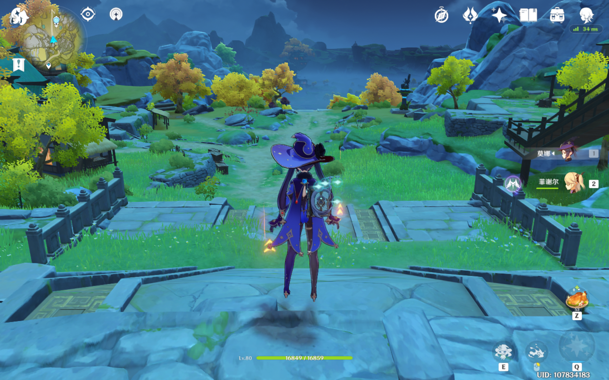

##### 操作手法

满体力后，从起点出发长按鼠标右键和键盘W键化作激流往前冲

等到体力槽消耗完，莫娜自动从水里钻出来的时候松开W键和鼠标右键并截图

##### 测试结果

1). 不受任何加成的莫娜


---

2). 吃过美味中原杂碎后的莫娜

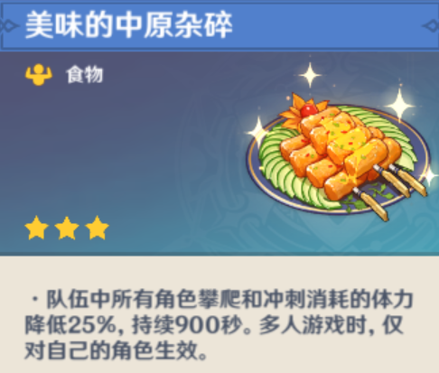

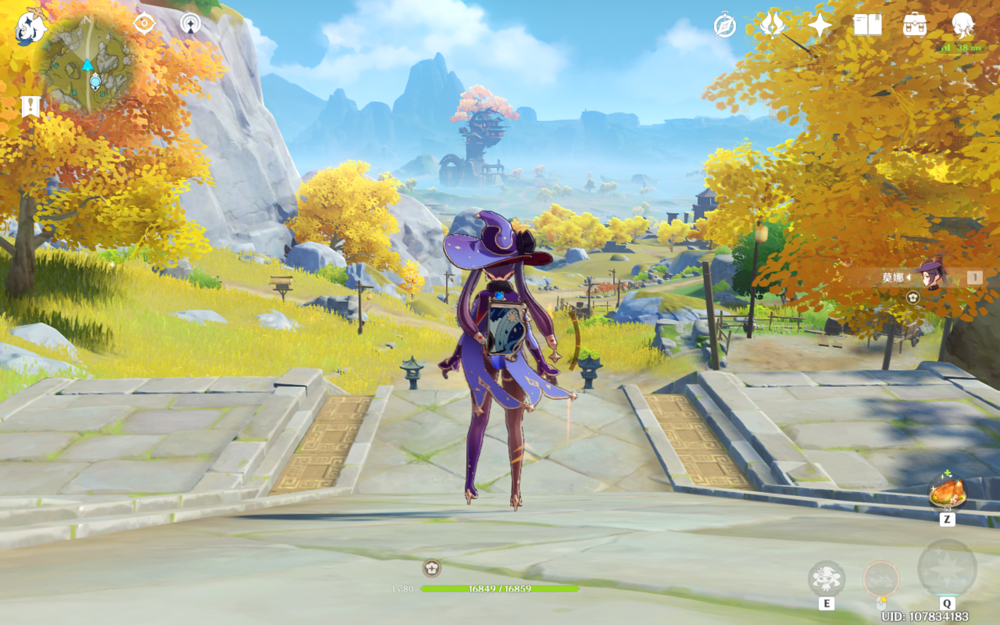

---

3). 队伍里带着雷泽的莫娜

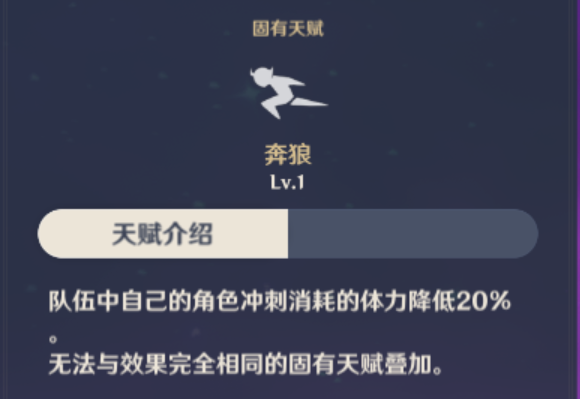


---

4). 队伍里带着凯亚的莫娜

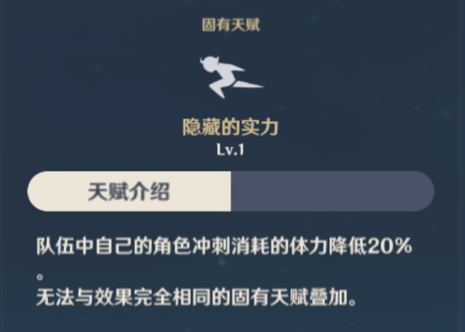

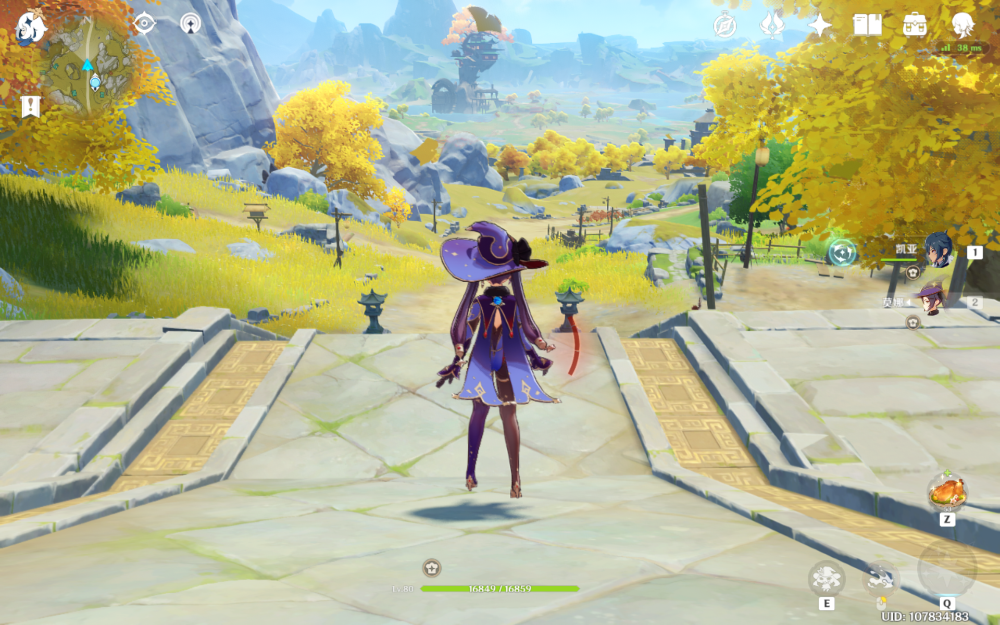

---

5). 队伍里带着双风的莫娜

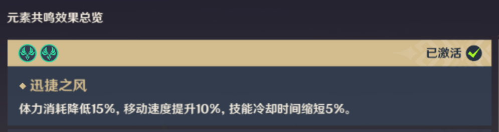


---

6). 装备着四风原典的莫娜

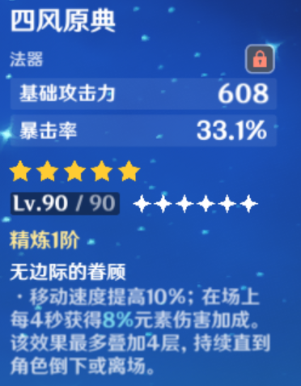

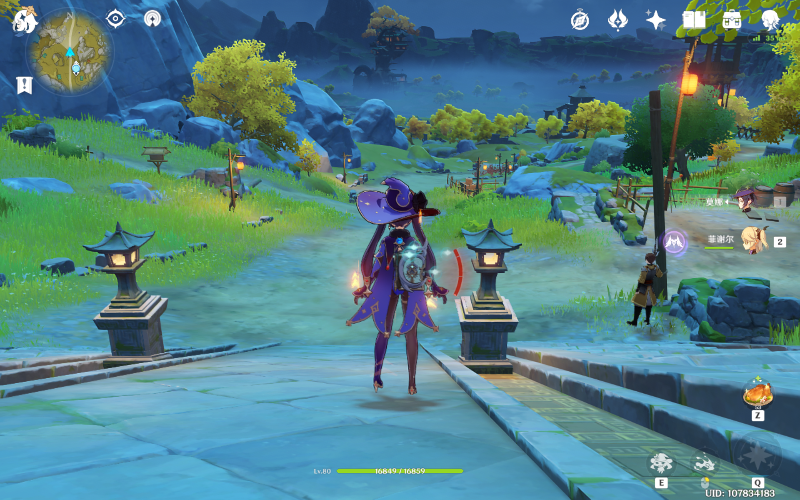

---

7). 开跑前带着猫爪护盾的莫娜

长按E能发出5个猫爪所以护盾持续时间11.5秒

但是因为长按E有后退效果所以此时莫娜起跑线比其他测试组略微靠后

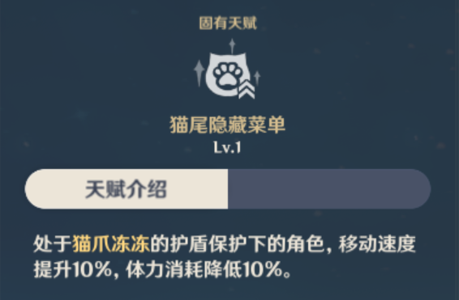

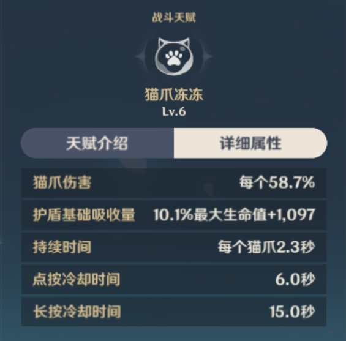

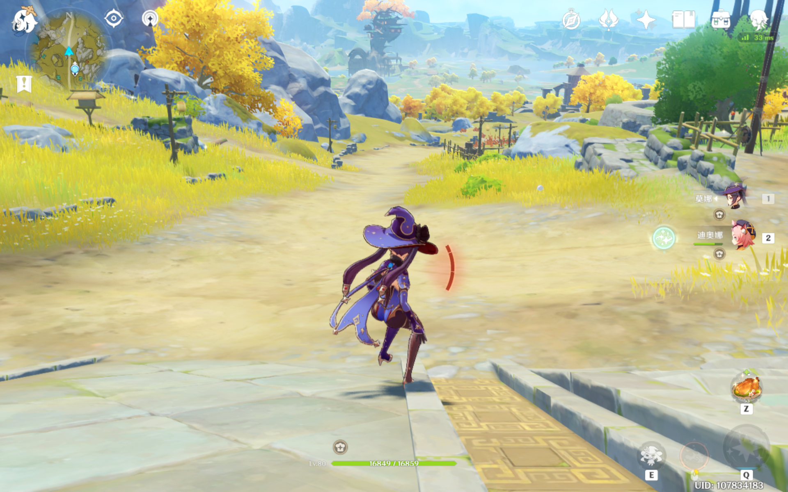

---

8). 开跑前带着芭芭拉水环的莫娜

芭芭拉水环持续时间为15秒

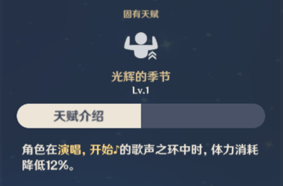

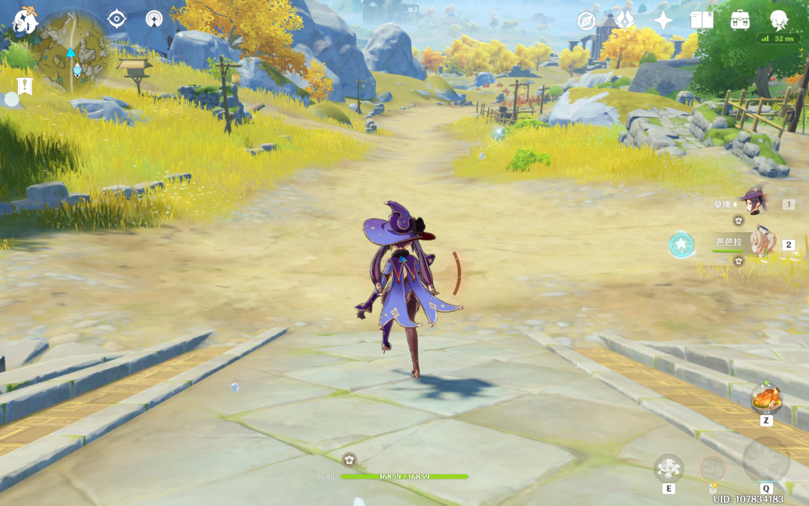

---

9). 带着芭芭拉水环，迪奥娜猫爪护盾，队伍里有双风系角色并且装备四风原典的莫娜

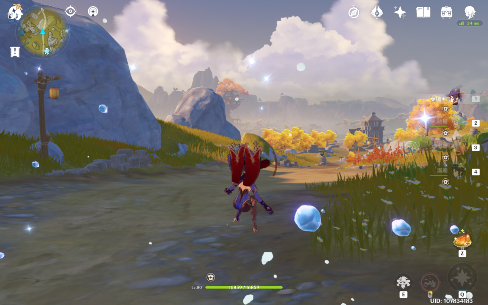

---

最后祝大家都能抽到自己心仪的五星角色或者五星武器！
